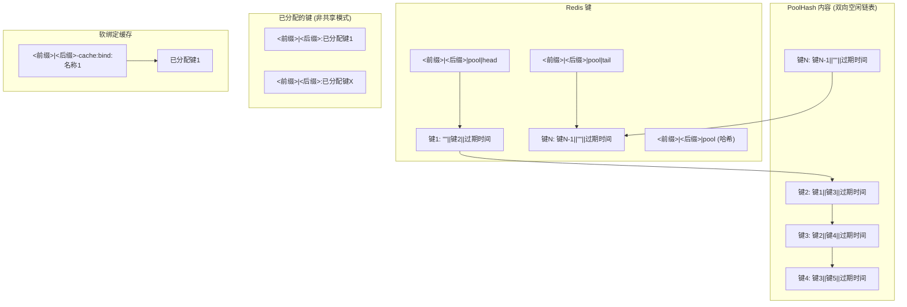

# RedisAllocator

## 项目概述

RedisAllocator 使用 Redis 提供健壮且高效的分布式资源管理组件。它专为需要高可用性、自动恢复和灵活分配策略的场景而设计，例如管理代理池、工作节点池或其他有限资源池。

其核心理念是利用 Redis 的速度和原子性的 Lua 脚本能力，来确保资源分配、锁定和任务队列的一致性与性能，同时通过在单个 Redis 实例上运行来保证操作的简便性与原子性。

> **注意**：RedisAllocator 针对单个 Redis 实例部署进行了优化。其对 Lua 脚本原子性的依赖使其不适用于标准的 Redis 集群配置。对于集群环境，请考虑使用如 RedLock 等替代锁定机制。

## 核心设计原则 & 功能

RedisAllocator 基于以下关键理念构建：

-   **高效的资源池化:** 管理一个可用资源池，允许客户端借出（分配）和归还（释放）资源。
-   **原子操作:** 广泛利用 Redis Lua 脚本来保证关键池管理操作的原子性，防止分布式环境下的竞争条件。
-   **自动恢复 (垃圾回收):** 实现可配置的垃圾回收机制，自动检测并回收不再使用的资源（例如，由于客户端崩溃或锁过期），这对于维护资源池的健康至关重要。
-   **灵活的分配模式:** 支持**独占**（`shared=False`，默认）分配模式（资源被一个客户端锁定）和**共享**（`shared=True`）分配模式（多个客户端可以并发使用同一资源）。
-   **资源优先级 (规划中):** 一个关键的即将推出的功能，允许根据定义的优先级分配资源（例如，优先分配更快的代理），将使用 Redis Sorted Sets 实现。
-   **资源亲和性 (软绑定):** 允许将特定名称（例如，工作节点 ID 或特定任务类型）与资源相关联，从而能够为该名称一致地重用同一资源，这对于缓存或特殊任务很有用。
-   **分布式锁:** 提供一个独立的、健壮的分布式锁 (`RedisLock`)，支持自动过期和可重入。
-   **任务队列:** 包含一个基础的分布式任务队列 (`RedisTaskQueue`)，用于协调多个消费者之间的工作。

### 核心功能

- **分布式锁**：提供强大的分布式锁机制，确保并发环境中的数据一致性
- **资源分配**：实现分布式资源分配系统，支持：
  - 基于优先级的分配
  - 软绑定
  - 垃圾回收
  - 健康检查
- **任务管理**：实现分布式任务队列系统，支持多个工作节点之间的高效任务处理
- **对象分配**：支持带有优先级分配和软绑定的资源分配
- **健康检查**：监控分布式实例的健康状态，自动处理不健康的资源
- **垃圾回收**：自动识别并回收未使用的资源，优化内存使用
- **共享模式**：可配置的分配模式，支持独占和共享资源使用
- **软绑定**：将命名对象与特定资源关联，实现一致性分配

## 文档

完整文档请访问我们的[官方文档站点](https://invoker-bot.github.io/RedisAllocator-python/)。

## 安装

```bash
pip install redis-allocator
```

## 快速开始

### 使用 RedisLock 进行分布式锁定

RedisLock 提供以下重要特性的分布式锁定：

- **自动过期**：锁会在超时期后自动释放，防止客户端失败时出现死锁
- **主动更新要求**：锁持有者必须主动更新锁以维持所有权
- **线程识别**：每个锁可以包含线程标识符来确定所有权
- **重入锁定**：同一线程/进程可以使用 rlock 方法重新获取其拥有的锁

**关键概念：**
- 如果锁持有者在超时期内未能更新，锁会自动释放
- 使用 `rlock()` 允许同一线程重新获取其已持有的锁
- 此实现仅适用于单个 Redis 实例（不适用于 Redis 集群）
- 在分布式系统中，每个节点应使用唯一标识符作为锁值

**简化的锁流程：**


### 使用 RedisAllocator 进行资源管理

```python
from redis import Redis
from redis_allocator import RedisAllocator

# 初始化 Redis 客户端
redis = Redis(host='localhost', port=6379)

# 创建 RedisAllocator 实例
allocator = RedisAllocator(
    redis, 
    prefix='myapp',
    suffix='allocator',
    shared=False  # 资源是否可以共享
)

# 向池中添加资源
allocator.extend(['resource-1', 'resource-2', 'resource-3'])

# 分配资源键（仅返回键）
key = allocator.malloc_key(timeout=120)
if key:
    try:
        # 使用分配的资源
        print(f"已分配资源: {key}")
    finally:
        # 完成后释放资源
        allocator.free_keys(key)

# 使用对象分配资源（返回 RedisAllocatorObject）
allocated_obj = allocator.malloc(timeout=120)
if allocated_obj:
    try:
        # 键作为属性可用
        print(f"已分配资源: {allocated_obj.key}")
        
        # 更新资源的锁超时
        allocated_obj.update(timeout=60)
    finally:
        # 完成后释放资源
        allocator.free(allocated_obj)

# 使用软绑定（将名称与资源关联）
allocator.update_soft_bind("worker-1", "resource-1")
# 解绑软绑定
allocator.unbind_soft_bind("worker-1")

# 垃圾回收（回收未使用的资源）
allocator.gc(count=10)  # 检查 10 个项目进行清理
```

### 共享模式与非共享模式

RedisAllocator 支持两种分配模式：

#### 非共享模式（默认，`shared=False`）
- 资源独占分配给一个客户端/线程
- 分配时，资源被锁定，防止其他客户端使用
- 资源保持锁定状态，直到明确释放或超时过期
- 适合需要独占使用资源的场景

```python
# 非共享分配器（独占资源使用）
exclusive_allocator = RedisAllocator(redis, "myapp", shared=False)

# 当资源被分配时，它被锁定且不能被其他客户端分配
key = exclusive_allocator.malloc_key(timeout=120)
if key:
    # 只有这个客户端可以使用该键，直到它被释放或超时过期
    exclusive_allocator.free_keys(key)
```

#### 共享模式（`shared=True`）
- 资源可以被多个客户端/线程同时使用
- 分配时，资源从空闲列表中可用，但不会被锁定
- 多个客户端可以同时分配和使用相同的资源
- 适合只读资源或支持并发访问的资源

```python
# 共享分配器（并发资源使用）
shared_allocator = RedisAllocator(redis, "myapp", shared=True)

# 资源可以被多个客户端同时访问
key = shared_allocator.malloc_key(timeout=120)
if key:
    # 其他客户端也可以分配和使用这个相同的键
    shared_allocator.free_keys(key)
```

### 软绑定机制

软绑定创建命名对象与分配资源之间的持久关联：

**分配器池结构（概念图）：**



**简化分配流程 (非共享模式):**


**简化释放流程 (非共享模式):**


```python
from redis import Redis
from redis_allocator import RedisAllocator, RedisAllocatableClass

# 创建带有名称的自定义可分配类
class MyResource(RedisAllocatableClass):
    def __init__(self, resource_name):
        self._name = resource_name
    
    def set_config(self, key, params):
        # 分配时配置资源
        self.key = key
        self.config = params
    
    @property
    def name(self):
        # 用于软绑定的名称
        return self._name

# 初始化分配器
redis = Redis(host='localhost', port=6379)
allocator = RedisAllocator(redis, "myapp")

# 向池中添加资源
allocator.extend(['resource-1', 'resource-2', 'resource-3'])

# 创建命名资源对象
resource = MyResource("database-connection")

# 第一次分配将从池中分配一个键
allocation1 = allocator.malloc(timeout=60, obj=resource)
print(f"第一次分配: {allocation1.key}")  # 例如 "resource-1"

# 释放资源
allocator.free(allocation1)

# 稍后对相同命名对象的分配将尝试重用相同的键
# 可以为绑定指定自定义缓存超时时间
allocation2 = allocator.malloc(timeout=60, obj=resource, cache_timeout=300)
print(f"第二次分配: {allocation2.key}")  # 将再次是 "resource-1"

# 软绑定的好处:
# 1. 资源亲和性 - 相同对象始终获得相同资源
# 2. 优化缓存和资源重用
# 3. 可预测的资源映射，便于调试
```

软绑定的关键特性：
- 绑定在资源释放后仍然存在，具有可配置的超时时间
- 如果绑定的资源不再可用，会自动分配新资源
- 可通过 `unbind_soft_bind(name)` 显式解除绑定
- 软绑定有自己的超时时间（默认 3600 秒），与资源锁分开

### 使用 RedisTaskQueue 进行分布式任务处理

**简化的任务队列流程：**


```python
from redis import Redis
from redis_allocator import RedisTaskQueue, TaskExecutePolicy
import json

# 初始化 Redis 客户端
redis = Redis(host='localhost', port=6379)

# 在工作者中处理任务
def process_task(task):
    # 处理任务（task 是 RedisTask 对象）
    # 可以访问 task.id, task.name, task.params
    # 可以使用 task.update(current, total) 更新进度
    return json.dumps({"result": "processed"})


# 创建任务队列
task_queue = RedisTaskQueue(redis, "myapp", task_fn=process_task)

# 使用查询方法提交任务
result = task_queue.query(
    id="task-123",
    name="example-task",
    params={"input": "data"},
    timeout=300,  # 可选超时（秒）
    policy=TaskExecutePolicy.Auto,  # 执行策略
    once=False  # 获取后是否删除结果
)

# 开始监听任务
task_queue.listen(
    names=["example-task"],  # 要监听的任务名称列表
    workers=128,  # 工作线程数
    event=None  # 可选事件，用于指示何时停止监听
)
```

## 模块

RedisAllocator 包含以下几个模块，每个模块提供特定的功能：

- **lock.py**: 提供 `RedisLock` 和 `RedisLockPool` 用于分布式锁机制
- **task_queue.py**: 实现 `RedisTaskQueue` 用于分布式任务处理
- **allocator.py**: 包含 `RedisAllocator` 及相关类用于资源分配

*(注意：这些模块内部的注释和 Lua 脚本解释最近经过重构，以提高清晰度。)*

### RedisAllocator 架构

RedisAllocator 在 Redis 中以双向链表结构维护资源：
- 可用资源保存在"空闲列表"中
- 在非共享模式下，分配的资源从空闲列表中移除并锁定
- 在共享模式下，分配的资源仍然可供其他客户端分配
- 垃圾收集器定期：
  - 回收锁已过期的锁定资源
  - 根据配置的超时时间移除过期资源
  - 清理分配和锁之间的不一致状态
- 软绑定作为具有自己超时期的独立锁实现

## 路线图

*   **核心功能 & 近期完成:**
    *   [x] 分布式锁 (`RedisLock`, `RedisLockPool`)
    *   [x] 资源分配器 (`RedisAllocator`) - 支持独占与共享模式
    *   [x] 任务队列 (`RedisTaskQueue`)
    *   [x] 软绑定机制
    *   [x] 基础的垃圾回收 & 健康检查框架
    *   [x] 文档改进 (共享模式, 软绑定, Lua脚本清晰度)
    *   [x] 基础单元测试 & 分配模式覆盖

*   **当前开发重点 (聚焦代理池需求):**
    *   [ ] **资源优先级:** 在 `RedisAllocator` 中实现基于优先级的分配，可能使用 Redis Sorted Sets (`ZSET`) 管理空闲池。 *(新增 - 高优先级)*
    *   [ ] **增强的 GC & 健康检查:** 提高可配置性 (触发器, 超时)，可能增加自定义健康检查逻辑的钩子。增强 GC 在代理失效场景下的鲁棒性。 *(增强 - 高优先级)*
    *   [ ] **性能基准测试 & 优化:** 在模拟代理池负载下分析核心分配、GC 和锁定操作的性能。优化 Lua 脚本和 Python 代码。 *(现有 - 中优先级, 关乎性能)*
    *   [ ] **增强的可观测性:** 添加分配率、池大小、GC 活动、锁竞争、软绑定使用情况等指标。改进日志记录。 *(现有 - 中优先级, 监控关键)*

*   **未来增强 (单实例 Redis 焦点):**
    *   **软绑定辅助函数:** 添加如 `get_bindings_for_key` 的 API 方法，方便管理快速更新模式中使用的代理-项目关系。 *(新增 - 中优先级)*
    *   **精细的错误处理 & 恢复:** 定义特定的异常类，提高对 Redis 问题或不一致状态的鲁棒性。 *(现有 - 中优先级)*
    *   **任务队列改进:** 考虑任务优先级、重试、延迟任务、批处理、死信队列 (优先级暂时低于核心分配器需求)。
    *   **高级分配器特性:** 公平性算法、资源加权、自定义元数据存储 (低优先级)。
    *   **锁定增强:** 竞争诊断、公平性选项 (低优先级)。
    *   **开发者体验:** 增强调试能力、更复杂的示例 (如简化的代理管理器模式)。

*   **范围之外 (当前方向):**
    *   原生 Redis 集群支持。
    *   超出单实例 Lua 能力的多键原子操作。

## 贡献

欢迎贡献和建议！请参阅 [CONTRIBUTING.md](CONTRIBUTING.md) 获取更多信息。

## 许可

本项目采用 MIT 许可证 - 详情请参阅 [LICENSE](LICENSE) 文件。

## 联系

如有问题或建议，请通过 GitHub Issues 联系我们。

*English documentation is available at [README.md](README.md)*
